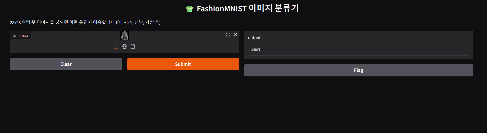
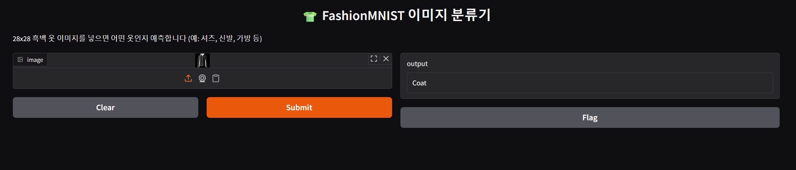

# 👕 FashionMNIST 이미지 분류기





PyTorch 기반 CNN 모델을 이용해 FashionMNIST 옷 이미지를 분류하는 프로젝트입니다.  
모델 학습 → FastAPI 백엔드 → Gradio 프론트엔드까지 전 과정을 포함합니다.

---

## 📁 폴더 구조

FASHION_MNIST/
├── pycache/ # 캐시 파일
├── data/ # FashionMNIST 데이터 저장 위치
├── venv/ # 가상환경 디렉토리
├── .gitignore # Git 제외 목록
├── fashion_classifier.py # 모델 학습 및 테스트 + 저장 (model_weights.pth, model.pt)
├── fashion_client.py # Gradio 기반 클라이언트 (프론트엔드)
├── fashion_server.py # FastAPI 서버 (백엔드 API)
├── model_weights.pth # 학습된 모델 파라미터 (state_dict)
├── model.pt # 전체 모델 저장본
├── requirements.txt # 필요한 패키지 목록
├── save_fashionmnist_images.py # 테스트 이미지 10장 저장용 스크립트

---

## 🚀 실행 방법

### 1. 가상환경 생성

```
python -m venv venv
source venv/bin/activate       # macOS/Linux
venv\Scripts\activate          # Windows
```

### 2. 패키지 설치

```
pip install -r requirements.txt
```

### 3. 모델 학습 및 저장

```
python fashion_classifier.py
```

- model_weights.pth 와 model.pt 파일이 저장됩니다.

### 4. FastAPI 서버 실행

```
uvicorn fashion_server:app --reload
```

### 5. Gradio 프론트 실행

```
python fashion_client.py
```

- 웹 브라우저에서 이미지 업로드 시, 분류 결과가 출력됩니다.

---

## FashionMNIST 테스트 이미지 10장 저장

```
python save_fashionmnist_images.py
```

./saved_test_images/ 폴더에 10장의 예시 이미지가 저장됩니다.

---

## 📚 분류 클래스

```
['T-shirt/top', 'Trouser', 'Pullover', 'Dress', 'Coat',
 'Sandal', 'Shirt', 'Sneaker', 'Bag', 'Ankle boot']
```

---

## 📌 사용 기술

- PyTorch
- FastAPI
- Gradio
- torchvision.datasets (FashionMNIST)
